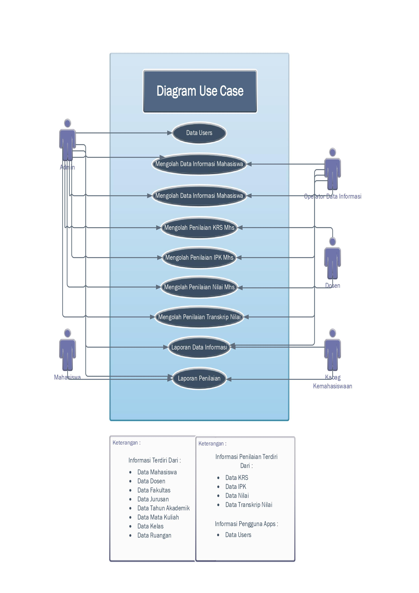

## Tugas Sidang : Membuat Aplikasi Berbasis Web Untuk Memenuhi Sidang Kelulusan Sekolah Menengah Kejuruan (SMK) Dengan Tema Sesuai Tempat Praktik Kerja Lapangan (PKL).

## Aplikasi Siadawa

Aplikasi Sistem Informasi Mahasiswa Dan Penilaian Mahasiswa adalah aplikasi berbasi web yang dibuat oleh penyusun dari hasil penelitiannya saat Praktek Kerja Lapangan (PKL) dan berfungsi untuk membantu saat dalam bidang informasi mahasiswa dan penilaian mahasiswa (akademik kemahasiswaan).

<h3>Dibuat oleh : </h3>
<ul><b>Nama : </b>Eko Muchamad Haryono</ul>
<ul><b>Nomor Induk Siswa : </b>10184827</ul>
<ul><b>Kompetensi Keahlian : </b> Rekayasa Perangkat Lunak (RPL)</ul>
<ul><b>Email : </b>ekomh13@gmail.com</ul>
<ul><b>Asal Sekolah : </b>SMK 1 Triple J</ul>

# Tema Aplikasi : Sesuai Tempat PKL (Praktik Lapangan Kerja)

<b>Tempat PKL : </b>Institut Agama Islam Tazkia
<b>Tema : </b>Bidang Informasi dan Penilaian Mahasiswa

# Aplikasi Berbasis Web Sistem Informasi Mahasiswa Dan Penilaian Mahasiswa (Siadawa) Menggunakan Codeigneter 3 (Tugas Akhir Sidang SMK)

<h3>Siadawa Singkatan Dari : </h3> 
<b>S</b> = Sistem = <b>S</b> 
<b>I</b> = Informasi = <b>I</b> 
<b>A</b> = Mahasiswa = <b>A</b> 
<b>D</b> = Dan = <b>D</b> 
<b>A</b> = Penilaian = <b>A</b> 
<b>WA</b> = Mahasiswa = <b>WA</b> 

## Desain Diagram

<h3>Alur Sistem</h3>

<h3>Diagram Use Case</h3>

<h3>Diagram Class</h3>

## Karya Tulis

<b>Notes : </b> Untuk Karya Tulis yang sudah dicetak dikumpulkan di sekolah SMK 1 Triple "J"

## Foto Aplikasi Siadawa

## Alat Yang Digunakan Untuk Membuat Web :

A. Hardware :
Laptop Aspire E1-472G. Speaksifikasi :

- Ram : 4GB DD3 L Memory
- Prosesor : Intel Core i5-4200U 1.6 GHz with Turbo Boost up to 2.5 GHz
- Tipe System : 64 bit
- VGA : NVIDIA GEFORCE GT 720M with 2GB Dedicated VRAM
- SSD : 128 GB
- HDD : 500 GB

B. Software :

- WAMP Server (Windows, Apache, MySQL, dan PHP)
- Visual Studio Code
- Sublime Merge
- Git
- Menggunakan PHP 7.2 (Agar Tidak Terjadi Masalah)

C. Komponen

- Codeigneter 3
- Bootstrap 4
- Template Tambahan :
  - Sb Admin 2 (Bootstrap 4) (Untuk Template Admin Full)
